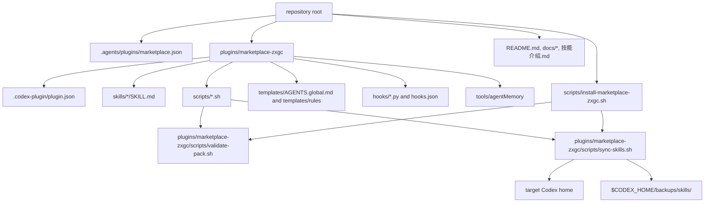

# marketplace-zxgc Architecture

This document maps how the local-first `marketplace-zxgc` repository is wired. It is intended for agents and maintainers who need to inspect, validate, install, or extend the marketplace without rediscovering the repository shape from scratch.

## System Map

## Ownership Boundaries

| Area | Path | Owned by marketplace | Notes |
|---|---|---|---|
| Marketplace catalog | `.agents/plugins/marketplace.json` | Yes | Points Codex marketplace discovery at the bundled plugin. |
| Plugin metadata | `plugins/marketplace-zxgc/.codex-plugin/plugin.json` | Yes | Public-facing plugin metadata, skill path, hooks, MCP and app manifests. |
| Skills | `plugins/marketplace-zxgc/skills/*/SKILL.md` | Yes | Packaged skills. Packaging a skill is separate from default activation on target machines. |
| Default sync policy | `plugins/marketplace-zxgc/scripts/sync-skills.sh` | Yes | `DEFAULT_SKILLS` controls which packaged skills become active by default. Adding a skill here requires explicit confirmation. |
| Install scripts | `scripts/*.sh`, `plugins/marketplace-zxgc/scripts/*.sh` | Yes | Dry-run/apply scripts for registration, sync, hooks, rules, AGENTS template and optional MCP. |
| Templates | `plugins/marketplace-zxgc/templates/**` | Yes | Portable, secret-free user-level templates only. Do not mirror raw local runtime rules. |
| Hooks | `plugins/marketplace-zxgc/hooks/**`, `hooks.json` | Yes | Hook scripts and generated hook config entrypoint. Machine-specific paths should be regenerated by installer scripts. |
| Optional MCP | `plugins/marketplace-zxgc/tools/agentMemory` | Yes, opt-in | Installed through `install-agent-memory-mcp.sh`; not default skill sync. |
| Runtime secrets | env files, tokens, cookies, private keys | No | Must stay outside this repository. |
| Target active skills | `$CODEX_HOME/skills` | No direct ownership | Sync scripts may copy/link packaged skills after dry-run review and backups. |

## Execution Flows

### Install or refresh marketplace

1. Run `scripts/install-marketplace-zxgc.sh --dry-run`.
2. Review marketplace registration, skill sync, rules, AGENTS and hooks actions.
3. Run `scripts/install-marketplace-zxgc.sh --apply` only after the dry run is acceptable.
4. The installer calls validation and delegates packaged asset operations to plugin scripts.

### Validate pack

1. `plugins/marketplace-zxgc/scripts/validate-pack.sh` validates JSON manifests.
2. It checks required directories and templates.
3. It runs bash syntax checks for install/sync/validation scripts.
4. It validates selected skill metadata when a local skill validator exists.
5. It runs a secret-like value scan over the plugin root.
6. It now also checks marketplace documentation and skill catalog coverage.

### Sync skills

1. `sync-skills.sh --dry-run` prints source, target, backup root and selected skills.
2. `sync-skills.sh --apply` backs up existing target skills under `$CODEX_HOME/backups/skills/<timestamp>`.
3. It copies or symlinks selected packaged skills into `$CODEX_HOME/skills`.
4. Deprecated active skill stubs are moved into the same backup area.

## Public Marketplace Requirements Extracted From References

The public references inspected for this repository are:

- https://github.com/addyosmani/agent-skills
- https://github.com/vercel-labs/skills
- https://github.com/MiniMax-AI/skills
- https://github.com/VoltAgent/awesome-openclaw-skills

Common patterns relevant to `marketplace-zxgc`:

| Requirement | Public pattern | Local adaptation |
|---|---|---|
| Discoverable entrypoint | README lists commands, skills, install options and supported agents. | Root README and plugin README point to architecture, catalog and install guide. |
| Skill metadata | Skills expose `SKILL.md` with name/description and usage conditions. | Each packaged skill has `SKILL.md`; catalog summarizes names and use cases. |
| Install paths | Repos describe global/project install and agent-specific locations. | Installer scripts use `$MARKETPLACE_ZXGC_HOME` and `$CODEX_HOME`; optional MCP remains explicit. |
| Validation | Public packs expose validation or contribution checks. | `validate-pack.sh` enforces manifests, script syntax, documentation, catalog coverage and secret scan. |
| Safety | Public registries warn users to review skills and sources before install. | Local pack is secret-free, local-first and requires dry-run/apply for target writes. |
| Single source of truth | Installers prefer canonical copies or controlled sync. | Packaged skills live under `plugins/marketplace-zxgc/skills`; default activation is separately controlled by `DEFAULT_SKILLS`. |

